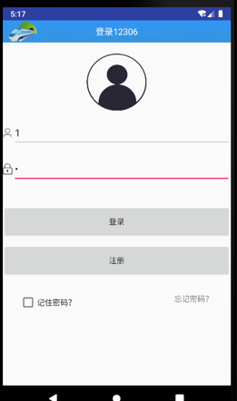
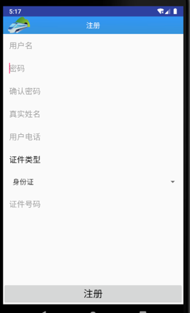

## 概述：

My12306 包含登录功能，时刻表查询功能，我的账户功能。

其中查询功能和我的账户功能是使用android中的碎片实现的，使用一个主活动包含这两个碎片。

时刻表查询功能包含了时刻表功能，列车时刻表是从极速数据接口申请的。

查询地点的活动是参考老师给出的样例进行修改的。

另外，该项目使用了百度sdk提供的定位服务，可以定位到查询地的所在城市。

### 登录界面：

实现的功能有登录检验，记住密码，用户注册功能。

## 查询车次界面

实现了查询功能，获取数据功能，选择城市功能。

  

## 用户账户界面

实现获取账户信息功能，更改账户信息功能。

